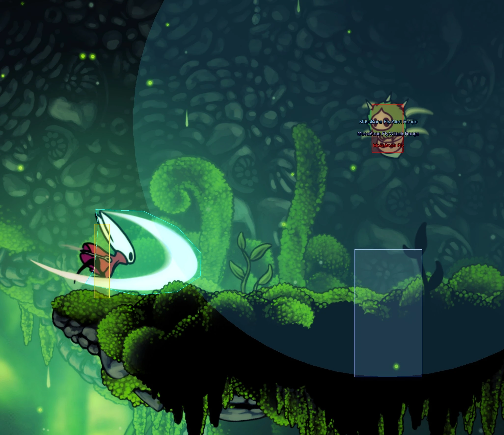
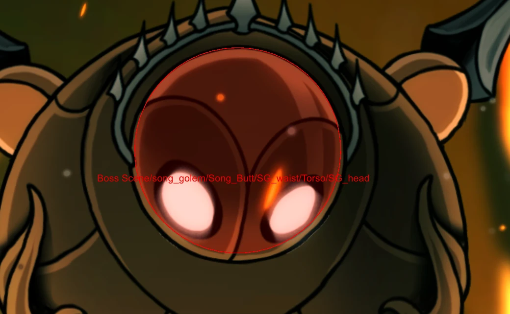

# Show Hitbox (Redone)

Advanced hitbox/collisions mod, that allows you to see hitboxes in the game.
It involves deep customization options, and overall complete re-implementation of in-game debug hitbox view code.  
With background fill, filters, outlines and labels presented as a separate options.  
On top of that pause and slow-mo functionality was added, so you can easily inspect how hitboxes interact on moving objects.


## Screenshots

### Enemy Hitbox Detection

*Enemy hitboxes displayed with fill, outline, and labels*

### Boss Weak Points

*Automatically detected boss hitboxes that the vanilla debug missed*

### Overlapping Labels

*Labels automatically stack to prevent overlap, with color variation for same-category hitboxes*

## Features

### Hitbox Visualization
- **Filled hitboxes** with configurable opacity for easy visibility
- **Outlined hitboxes** for precise boundary detection
- **Color-coded categories** for quick identification:
  - 🔴 **Red** - Enemy hitboxes (things with health)
  - 🔴 **Red** - Danger zones (spikes, hazards, enemy attacks)
  - 🔵 **Cyan** - Player attacks (nail slashes, spells)
  - 🔵 **Blue** - Regions (alert ranges, trigger zones)
  - 🟢 **Green** - Terrain colliders
  - 🟡 **Yellow** - Player body
  - etc

### Smart Labels
- Displays GameObject names for each hitbox
- **Anti-overlap system** - Labels automatically stack when they would overlap
- **Color variation** - Same-category hitboxes get distinct colors for differentiation
- Configurable font size with outline for visibility
- Option to hide player labels for cleaner view

### Time Control
- **Pause** - Freeze the game completely to analyze hitboxes
- **Slow-motion** - Configurable speed factor for studying fast-moving enemies

### Advanced Collider Detection
- Supports all Unity 2D collider types:
  - BoxCollider2D
  - CircleCollider2D
  - PolygonCollider2D
  - EdgeCollider2D
  - CapsuleCollider2D
- **Automatic scanning** - Finds and visualizes hitboxes that the game's original debug system misses _(example: Fourth Chorus boss)_

## Installation

1. Download [BepInEx](https://github.com/BepInEx/BepInEx)
   and [install](https://docs.bepinex.dev/articles/user_guide/installation/index.html)
2. Install [BepInExUtils](https://github.com/T2PeNBiX99wcoxKv3A4g/BepinEx-Utils/releases/latest) dependency
3. Download the latest release of HKSS.ShowHitbox
4. Place the `HKSS.ShowHitbox.dll` in your `BepInEx/plugins` folder
5. Launch the game

## Default Controls

| Key | Action |
|-----|--------|
| `F11` | Toggle hitbox display |
| `Pause` | Pause/Resume game |
| `Scroll Lock` | Toggle slow-motion |

All keybinds are configurable in the config file.

## Configuration

After first launch, a config file is created at `BepInEx/config/io.github.ykysnk.HKSS.ShowHitbox.cfg`

### Options
| Setting | Default | Description |
|---------|---------|-------------|
| `ToggleKey` | F11 | Key to toggle hitbox display |
| `ShowHitbox` | false | Show hitboxes on startup |
| `MoreInfos` | true | Show labels on hitboxes |

### Time Control
| Setting | Default | Description |
|---------|---------|-------------|
| `EnablePause` | true | Enable pause functionality |
| `PauseKey` | Pause | Key to pause/resume |
| `EnableSlowMo` | true | Enable slow-motion |
| `SlowMoKey` | ScrollLock | Key to toggle slow-mo |
| `SlowMoFactor` | 0.25 | Slow-mo speed (0.1 = very slow, 0.5 = half speed) |

### Fill Options
| Setting | Default | Description |
|---------|---------|-------------|
| `FillHitboxes` | true | Enable filled hitbox rendering |
| `FillAlpha` | 0.15 | Fill opacity (0.0 - 1.0) |

### Fill Filters
Control which hitbox types get filled:
- `FillDanger` (true) - Spikes, hazards
- `FillEnemy` (true) - Things with health
- `FillPlayerAttack` (true) - Nail slashes, spells
- `FillWater` (true) - Water regions
- `FillTerrain` (false) - Terrain colliders
- `FillTilemap` (false) - Tilemap colliders
- `FillRegion` (false) - Region triggers
- `FillRoof` (false) - Roof colliders
- `FillTransitionPoint` (false) - Scene transitions
- `FillSandRegion` (false) - Sand regions
- `FillShardRegion` (false) - Shard regions
- `FillCameraLock` (false) - Camera lock zones

### Outline Options
| Setting | Default | Description |
|---------|---------|-------------|
| `OutlineHitboxes` | true | Enable hitbox outlines |

### Outline Filters
Same categories as fill filters, all default to `true`.

### Label Options
| Setting | Default | Description |
|---------|---------|-------------|
| `LabelFontSize` | 14 | Font size (8-32) |
| `LabelOutline` | true | Black outline for visibility |
| `HidePlayerLabels` | true | Hide "Hero_Hornet" labels |

### Label Filters
Same categories as fill filters. By default, only `LabelDanger` and `LabelEnemy` are enabled.

## Technical Details

### How It Works

1. **Harmony Patches** - Intercepts the game's `DebugDrawColliderRuntime.OnPostRenderCamera` to replace the original rendering with our enhanced version.

2. **GL Rendering** - Uses Unity's immediate-mode GL API for efficient hitbox rendering:
   - `GL.TRIANGLES` for filled shapes
   - `GL.LINES` for outlines
   - Proper triangulation for complex polygons (ear-clipping algorithm)

3. **Collider Scanner** - Periodically scans for GameObjects with `HealthManager`, `DamageHero`, or `DamageEnemies` components that lack debug visualization, and adds it automatically.

4. **Color System** - Centralized color management ensures consistency between fills, outlines, and labels, with automatic variation for overlapping same-category hitboxes.

### File Structure

```
HKSS.ShowHitbox/
├── Main.cs                          # Plugin entry, config definitions
├── HitboxColors.cs                  # Shared color utility
├── Behaviour/
│   ├── MoreInfosController.cs       # Label rendering (OnGUI)
│   └── ColliderScanner.cs           # Auto-detection of missing hitboxes
└── Patches/
    └── DebugDrawColliderRuntimePatches.cs  # Harmony patches, GL rendering
```

## Compatibility

- Hollow Knight: Silksong (Demo/Full Release)
- BepInEx 5.x

## Known Issues

- Complex terrain/tilemap colliders may impact performance when filled (disabled by default)
- Some dynamically spawned hitboxes may take up to 0.5 seconds to appear (scanner interval)

## License

This project is licensed under the [MIT License](LICENSE).

## Credits

- [**ykysnk**](https://www.nexusmods.com/hollowknightsilksong/users/176858715) - for his [original mod](https://www.nexusmods.com/hollowknightsilksong/mods/593)
- **Team Cherry** - for their DebugDrawColliderRuntime class